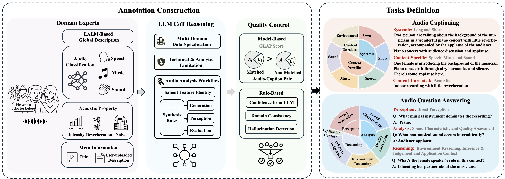

## MECAT: A Multi-Experts Constructed Benchmark for Fine-Grained Audio Understanding Tasks
[**📖 arXiv**](https://arxiv.org/abs/2507.23511) | [**🛠️ GitHub Code**](https://github.com/xiaomi-research/mecat) | [**🔊 MECAT-Caption Dataset (HuggingFace)**](https://huggingface.co/datasets/mispeech/MECAT-Caption) [**🔊 MECAT-QA Dataset (HuggingFace)**](https://huggingface.co/datasets/mispeech/MECAT-QA)

<p align="center"></p>

## Table of Contents
- [1. Introduction](#1-introduction)
- [2. Features](#2-features)
- [3. Data Distribution](#3-data-distribution)
- [4. Tasks](#4-tasks)
  - [4.1 Audio-Captioning](#41-audio-captioning)
  - [4.2 Audio-Question-Answering](#42-audio-question-answering)
- [5. Evaluation Metrics](#5-evaluation-metrics)
- [6. Usage](#6-usage)
  - [6.1 Installation](#61-installation)
  - [6.2 Quick Start with Qwen2-Audio Example](#62-quick-start-with-qwen2-audio-example)
  - [6.3 Command Line Evaluation](#63-command-line-evaluation)
- [7. Results](#7-results)
- [8. Acknowledgement](#8-acknowledgement)
- [9. Contributing](#9-contributing)
- [10. Citation](#10-citation)
- [11. License](#11-license)

## 1. Introduction 
MECAT is a comprehensive benchmark constructed on **large-scale data** to evaluate machine understanding of audio content through two core tasks:
- **Audio Captioning**: Generating textual descriptions for given audio
- **Audio Question Answering**: Answering questions about given audio




## 2. Features 
- **Data Source**：Diverse-scenario coverage via the part of ACAV100M dataset
- **Processing Pipeline**:
  - **MetaInfo**: Source video metadata extraction (titles/descriptions)
  - **Content-Specific**: Content-specific feature extraction using 10-20 dedicated models (speech/music/general audio)
  - **Content-Unrelated**: Non-content audio analysis: quality metrics, loudness measurements, reverberation assessment
- **Understanding & Genration**: LLM-powered comprehension & generation with Chain-of-Thought
- **Quality Control**： Multi-stage verification framework
- **Evluation System**: Multi-perspective assessment with progressive difficulty levels
    
## 3. Data Distribution

<table class="tg"><thead>
  <tr>
    <th class="tg-lboi" rowspan="2">Data Code</th>
    <th class="tg-lboi" rowspan="2"> Description </th>
    <th class="tg-lboi" colspan="2">Audio Caption </th>
    <th class="tg-lboi" colspan="2">Audio Question Answering</th>
  </tr>
  <tr>
    <th class="tg-lboi"># Pairs (Train)</th>
    <th class="tg-lboi"># Pairs (Test)</th>
    <th class="tg-lboi"># Pairs (Train)</th>
    <th class="tg-lboi"># Pairs (Test)</th>
  </tr></thead>
<tbody>
  <tr>
    <td class="tg-lboi">000</td>
    <td class="tg-lboi">silence </td>
    <td class="tg-lboi">173</td>
    <td class="tg-lboi">179</td>
    <td class="tg-lboi">865</td>
    <td class="tg-lboi">895</td>
  </tr>
  <tr>
    <td class="tg-lboi">00A</td>
    <td class="tg-lboi">general sound excluding speech and music</td>
    <td class="tg-lboi">837</td>
    <td class="tg-lboi">848</td>
    <td class="tg-lboi">4185</td>
    <td class="tg-lboi">4240</td>
  </tr>
  <tr>
    <td class="tg-lboi">0M0</td>
    <td class="tg-lboi">music</td>
    <td class="tg-lboi">2593</td>
    <td class="tg-lboi">2593</td>
    <td class="tg-lboi">12965</td>
    <td class="tg-lboi">12965</td>
  </tr>
  <tr>
    <td class="tg-lboi">0MA</td>
    <td class="tg-lboi">music and general sound</td>
    <td class="tg-lboi">206</td>
    <td class="tg-lboi">199</td>
    <td class="tg-lboi">1030</td>
    <td class="tg-lboi">995</td>
  </tr>
  <tr>
    <td class="tg-lboi">S00</td>
    <td class="tg-lboi">speech</td>
    <td class="tg-lboi">7839</td>
    <td class="tg-lboi">7839</td>
    <td class="tg-lboi">39195</td>
    <td class="tg-lboi">39195</td>
  </tr>
  <tr>
    <td class="tg-lboi">S0A</td>
    <td class="tg-lboi">speech and general sound</td>
    <td class="tg-lboi">2424</td>
    <td class="tg-lboi">2439</td>
    <td class="tg-lboi">12120</td>
    <td class="tg-lboi">12195</td>
  </tr>
  <tr>
    <td class="tg-lboi">SM0</td>
    <td class="tg-lboi">speech and music</td>
    <td class="tg-lboi">5312</td>
    <td class="tg-lboi">5312</td>
    <td class="tg-lboi">26560</td>
    <td class="tg-lboi">26560</td>
  </tr>
  <tr>
    <td class="tg-lboi">SMA</td>
    <td class="tg-lboi">speech, music and general sound</td>
    <td class="tg-lboi">668</td>
    <td class="tg-lboi">643</td>
    <td class="tg-lboi">3340</td>
    <td class="tg-lboi">3215</td>
  </tr>
</tbody></table>

## 4. Tasks
### 4.1 Audio-Captioning

<table class="tg"><thead>
  <tr>
    <th class="tg-yla0"><span style="font-weight:bold">Type</span></th>
    <th class="tg-yla0"><span style="font-weight:bold">Subtask</span></th>
    <th class="tg-yla0"><span style="font-weight:bold">Category</span></th>
    <th class="tg-yla0"><span style="font-weight:bold">Level</span></th>
    <th class="tg-yla0"><span style="font-weight:bold">Descrption</span></th>
    <th class="tg-yla0"><span style="font-weight:bold">Evaluated Data Abbreviation</span></th>
  </tr></thead>
<tbody>
  <tr>
    <td class="tg-yla0" rowspan="2"><span style="font-weight:bold">Systemtic</span></td>
    <td class="tg-cly1">Short</td>
    <td class="tg-cly1"></td>
    <td class="tg-cly1">🔵 Specialized</td>
    <td class="tg-cly1">Simplified caption over the whole audio within 15 words</td>
    <td class="tg-cly1">000, 00A, 0M0, 0MA<br>S00, S0A, SM0, SMA</td>
  </tr>
  <tr>
    <td class="tg-cly1">Long</td>
    <td class="tg-cly1"></td>
    <td class="tg-cly1">🔵 Specialized</td>
    <td class="tg-cly1">Caption over the whole audio using 1-2 sentences</td>
    <td class="tg-cly1">000, 00A, 0M0, 0MA<br>S00, S0A, SM0, SMA</td>
  </tr>
  <tr>
    <td class="tg-yla0" rowspan="6"><span style="font-weight:bold">Content-Specific</span></td>
    <td class="tg-cly1" rowspan="2">Speech</td>
    <td class="tg-cly1">Clean</td>
    <td class="tg-cly1">🟢 Basic</td>
    <td class="tg-cly1">Caption over clean speech&nbsp;&nbsp;</td>
    <td class="tg-cly1">S00</td>
  </tr>
  <tr>
    <td class="tg-cly1">Mixed</td>
    <td class="tg-cly1">🔴 Complex</td>
    <td class="tg-cly1">Caption over speech with music/sound interference </td>
    <td class="tg-cly1">0MA, S0A, SM0, SMA</td>
  </tr>
  <tr>
    <td class="tg-cly1" rowspan="2">Music</td>
    <td class="tg-cly1">Clean</td>
    <td class="tg-cly1">🟢 Basic</td>
    <td class="tg-cly1">Caption over clean Music&nbsp;&nbsp;&nbsp;&nbsp;&nbsp;</td>
    <td class="tg-cly1">0M0</td>
  </tr>
  <tr>
    <td class="tg-cly1">Mixed</td>
    <td class="tg-cly1">🔴 Complex</td>
    <td class="tg-cly1">Caption over music with speech/sound interference</td>
    <td class="tg-cly1">0MA, S0A, SM0, SMA</td>
  </tr>
  <tr>
    <td class="tg-cly1" rowspan="2">Sound</td>
    <td class="tg-cly1">Clear</td>
    <td class="tg-cly1">🟢 Basic</td>
    <td class="tg-cly1">Caption over general sound excluding speech and music</td>
    <td class="tg-cly1">00A</td>
  </tr>
  <tr>
    <td class="tg-cly1">Mixed</td>
    <td class="tg-cly1">🔴 Complex</td>
    <td class="tg-cly1">Caption over sound with speech/music interference</td>
    <td class="tg-cly1">0MA, S0A, SM0, SMA</td>
  </tr>
  <tr>
    <td class="tg-yla0"><span style="font-weight:bold">Content-Unrelated</span></td>
    <td class="tg-cly1">Environment</td>
    <td class="tg-cly1"></td>
    <td class="tg-cly1">🔵 Specialized</td>
    <td class="tg-cly1">Caption over acoustic characteristic and environment</td>
    <td class="tg-cly1">000, 00A, 0M0, 0MA<br>S00, S0A, SM0, SMA</td>
  </tr>
</tbody></table>

### 4.2 Audio-Question-Answering
#### Description
<table class="tg"><thead>
  <tr>
    <th class="tg-yla0"><span style="font-weight:bold">Type</span></th>
    <th class="tg-yla0"><span style="font-weight:bold">Subtask</span></th>
    <th class="tg-yla0"><span style="font-weight:bold">Level</span></th>
    <th class="tg-yla0"><span style="font-weight:bold">Description</span></th>
    <th class="tg-yla0"><span style="font-weight:bold">Data Abbreviation</span></th>
  </tr></thead>
<tbody>
  <tr>
    <td class="tg-yla0"><span style="font-weight:bold">Perception</span></td>
    <td class="tg-cly1">Direct_Perception</td>
    <td class="tg-cly1">🟢🟡</td>
    <td class="tg-cly1">Perceive sound types</td>
    <td class="tg-cly1">000, 00A, 0M0, 0MA, S00, S0A, SM0, SMA</td>
  </tr>
  <tr>
    <td class="tg-yla0" rowspan="2"><span style="font-weight:bold">Analysis</span></td>
    <td class="tg-cly1">Sound_Characteristics</td>
    <td class="tg-cly1">🟢🟡🟠🔴</td>
    <td class="tg-cly1">Analyze sound characteristics</td>
    <td class="tg-cly1">000, 00A, 0M0, 0MA, S00, S0A, SM0, SMA</td>
  </tr>
  <tr>
    <td class="tg-cly1">Quality_Assessment </td>
    <td class="tg-cly1">🟢🟡🟠🔴</td>
    <td class="tg-cly1">Analyze sound quality</td>
    <td class="tg-cly1">000, 00A, 0M0, 0MA, S00, S0A, SM0, SMA</td>
  </tr>
  <tr>
    <td class="tg-yla0" rowspan="3"><span style="font-weight:bold">Reasoning</span></td>
    <td class="tg-cly1">Environment_Reasoning </td>
    <td class="tg-cly1">🟢🟡🟠🔴</td>
    <td class="tg-cly1">Reasoning acoustic environment </td>
    <td class="tg-cly1">000, 00A, 0M0, 0MA, S00, S0A, SM0, SMA</td>
  </tr>
  <tr>
    <td class="tg-cly1">Inference_Judgment</td>
    <td class="tg-cly1">🟢🟡🟠🔴</td>
    <td class="tg-cly1">Cross-modal reasoning </td>
    <td class="tg-cly1">000, 00A, 0M0, 0MA, S00, S0A, SM0, SMA</td>
  </tr>
  <tr>
    <td class="tg-cly1">Application_Context </td>
    <td class="tg-cly1">🟢🟡🟠🔴</td>
    <td class="tg-cly1">Semantic understanding </td>
    <td class="tg-cly1">000, 00A, 0M0, 0MA, S00, S0A, SM0, SMA</td>
  </tr>
</tbody></table>

#### Difficulty Distribution
<table class="tg"><thead>
  <tr>
    <th class="tg-cly1">Difficulty</th>
    <th class="tg-cly1">Symbol</th>
    <th class="tg-cly1">Ratio (%)</th>
    <th class="tg-cly1">Description</th>
  </tr></thead>
<tbody>
  <tr>
    <td class="tg-cly1">Basic</td>
    <td class="tg-cly1"><span style="color:#000">🟢</span></td>
    <td class="tg-cly1">25</td>
    <td class="tg-cly1">Direct descriptive questions</td>
  </tr>
  <tr>
    <td class="tg-cly1">Intermediate</td>
    <td class="tg-cly1"><span style="color:#000">🟡</span></td>
    <td class="tg-cly1">35</td>
    <td class="tg-cly1">Analytical questions&nbsp;&nbsp;&nbsp;</td>
  </tr>
  <tr>
    <td class="tg-cly1">Advanced</td>
    <td class="tg-cly1"><span style="color:#000">🟠</span></td>
    <td class="tg-cly1">25</td>
    <td class="tg-cly1">Inferential questions&nbsp;&nbsp;</td>
  </tr>
  <tr>
    <td class="tg-cly1">Complex</td>
    <td class="tg-cly1"><span style="color:#000">🔴</span></td>
    <td class="tg-cly1">15</td>
    <td class="tg-cly1">Comprehensive judgment questions</td>
  </tr>
</tbody></table>

## 5. Evaluation Metrics

MECAT supports multiple evaluation metrics for comprehensive assessment:
- **Traditional Metrics**: BLEU
- **FENSE**: Fluency Error-based Sentence-bert Evaluation for audio captioning
- **DATE**: Discriminability based Audio Task Evaluation - DATE is particularly effective for audio captioning and question-answering tasks as it considers both the quality of generated text and the model's discriminative capabilities.


## 6. Usage

### 6.1 Installation

```bash
pip install git+https://git.n.xiaomi.com/niuyadong/mecat_public.git
```

### 6.2 Quick Start with Qwen2-Audio Example

This section provides a complete walkthrough of evaluating audio models using MECAT, using Qwen2-Audio as a practical example. The same approach can be adapted for other audio understanding models.

#### 6.2.1 Preliminary Steps: Environment Setup and Model Loading

```python
import torch
from tqdm import tqdm
from transformers import AutoProcessor, Qwen2AudioForConditionalGeneration

# Device setup
device = "cuda" if torch.cuda.is_available() else "cpu"
print(f"Using device: {device}")

# Load Qwen2-Audio model and processor
model = Qwen2AudioForConditionalGeneration.from_pretrained(
    "Qwen/Qwen2-Audio-7B", 
    trust_remote_code=True,
    device_map="auto"
)
processor = AutoProcessor.from_pretrained(
    "Qwen/Qwen2-Audio-7B", 
    trust_remote_code=True
)
```

#### 6.2.2 Audio Caption Evaluation

##### Step 1: Load MECAT-Caption Dataset
```python
from datasets import load_dataset
data = load_dataset(
    'mispeech/MECAT-Caption', 
    split='test', 
)
print(f"Loaded {len(data)} samples from datasets")
```

##### Step 2: Generate and Evaluate Captions

**Method 1: Single Dictionary Approach (for non-instruction-following models)**

*Generation:*
```python
from mecat import evaluate
# Generate general predictions using a single prompt
predictions = {}

for item in tqdm(data, desc="Generating general captions"):
    key = item['__key__']
    audio = item['flac']['array']
    sampling_rate = item['flac']['sampling_rate']
    # Note: the sampling rate of audio provided by MECAT is 16kHz 
    
    # Create general prompt for caption generation
    prompt = "<|audio_bos|><|AUDIO|><|audio_eos|>Generate the caption in English:"

    # Process inputs
    inputs = processor(
        text=prompt, 
        audio=audio, 
        sampling_rate=sampling_rate,
        return_tensors="pt"
    ).to(device)
    
    # Generate response
    with torch.no_grad():
        generated_ids = model.generate(
            **inputs, 
            max_length=512,
            do_sample=False,
            temperature=0.1
        )
    
    # Decode response
    generated_ids = generated_ids[:, inputs.input_ids.size(1):]
    response = processor.batch_decode(
        generated_ids, 
        skip_special_tokens=True, 
        clean_up_tokenization_spaces=False
    )[0]
    predictions[key] = response.strip()

print(f"Generated {len(predictions)} general captions")

# Save single prediction file
import csv
with open('caption_predictions.csv', 'w', encoding='utf-8') as f:
    writer = csv.writer(f, quoting=csv.QUOTE_ALL)
    for key, value in predictions.items():
        writer.writerow([key, value])
```

*Evaluation:*
```python
# Evaluate general predictions across all subtasks
results = evaluate(
    predicted_data=predictions,
    task='caption', 
    metrics=['fense', 'date']
)

print("\nSingle Dictionary Evaluation Results:")
print(results)
```

**Method 2: Multi-Dictionary Approach (recommended for instruction-following models)**

*Generation:*
```python
# Generate task-specific predictions using different prompts
task_prompts = {
    'long': "<|audio_bos|><|AUDIO|><|audio_eos|>Listen to this audio and describe it in 1-2 sentences:",
    'short': "<|audio_bos|><|AUDIO|><|audio_eos|>Listen to the audio and provide a caption for this audio within 15 words:",
    'speech': "<|audio_bos|><|AUDIO|><|audio_eos|>Listen to the audio and provide a caption describing the speech content in this audio:",
    'music': "<|audio_bos|><|AUDIO|><|audio_eos|>Listen to the audio and provide a caption for the music content in this audio:",
    'sound': "<|audio_bos|><|AUDIO|><|audio_eos|>Listen to the audio and provide a general sound excluding speech and music:",
    'environment': "<|audio_bos|><|AUDIO|><|audio_eos|>Listen to the audio and provide a caption for quality or acoustic environment for this audio:"
}

# Generate predictions for each subtask
subtask_predictions = {}

for subtask, prompt_template in task_prompts.items():
    print(f"\nGenerating {subtask} captions...")
    subtask_predictions[subtask] = {}
    
    for item in tqdm(data, desc=f"Generating {subtask} captions"):
        key = item['__key__']
        audio = item['flac']['array']
        sampling_rate = item['flac']['sampling_rate']
        
        # Process inputs with task-specific prompt
        inputs = processor(
            text=prompt_template, 
            audio=audio, 
            sampling_rate=sampling_rate,
            return_tensors="pt"
        ).to(device)
        
        # Generate response
        with torch.no_grad():
            generated_ids = model.generate(
                **inputs, 
                max_length=512,
                do_sample=False,
                temperature=0.1
            )
        
        # Decode response
        generated_ids = generated_ids[:, inputs.input_ids.size(1):]
        response = processor.batch_decode(
            generated_ids, 
            skip_special_tokens=True, 
            clean_up_tokenization_spaces=False
        )[0]
        subtask_predictions[subtask][key] = response.strip()

# Save separate prediction files for each subtask
for subtask, preds in subtask_predictions.items():
    filename = f'{subtask}_caption.csv'
    with open(filename, 'w', encoding='utf-8') as f:
        writer = csv.writer(f, quoting=csv.QUOTE_ALL)
        for key, value in preds.items():
            writer.writerow([key, value])
    print(f"Saved {len(preds)} {subtask} predictions to {filename}")
```

*Evaluation:*
```python
# Evaluate task-specific predictions for optimal performance
results_multisubtask = evaluate(
    predicted_data=subtask_predictions,
    task='caption', 
    metrics=['fense', 'date']
)

print("\nMulti-Dictionary Evaluation Results:")
print(results_multisubtask)
```

##### Step 3: Expected Results

**Expected Caption Evaluation Output:** This result does not represent the actual performance of Qwen2-Audio-7B
```python
   subtask     num_samples  fense  date
 content_long        20052   47.3 40.5
content_short        20052   45.8 41.0 
  pure_speech         7839   30.9 28.5 
 mixed_speech         8593   31.7 27.1 
   pure_music         2593   42.1 50.7
  mixed_music         8593   28.3 33.1
   pure_sound          848   41.2 46.6 
  mixed_sound         8593   16.2 34.1 
  environment        20052   45.4 47.8
score_caption         <NA>   35.2 39.3    
```

**Note**: 
The formulae of `score_caption`: 
$$
S_{\rm caption} =  0.4*\times({S_{\rm long}*0.8 + S_{\rm short}}*0.2) + 0.4\times(S_{\rm speech}*0.6 + S_{\rm music}*0.3 + S_{\rm sound}*0.1) + 0.2\times S_{\rm environment}
$$
where $S_{\rm speech}, S_{\rm music}$ and $S_{\rm sound}$ were the average score of pure data and mixed data, e.g.,
$$
S_{\rm speech} = 0.5\times S_{\rm speech,pure}+0.5\times S_{\rm speech,mixed}
$$


#### 6.2.3 Audio Question Answering Evaluation

##### Step 1: Load MECAT-QA Dataset
```python
# Load MECAT-QA test data 
qa_data = load_dataset(
    'mispeech/MECAT-QA', 
    split='test', 
)
print(f"Loaded {len(qa_data)} QA samples from datasets")
```

##### Step 2: Generate and Evaluate Answers

*Generation:*
```python
# Generate predictions for each question-audio pair
qa_predictions = {}

for item in tqdm(qa_data, desc="Generating answers"):
    key = item['__key__']
    audio = item['flac']['array']
    sampling_rate = item['flac']['sampling_rate']
    question = item['json']['question']
    
    
    # Create prompt for QA
    prompt = f"<|audio_bos|><|AUDIO|><|audio_eos|>{question}"
    
    # Process inputs
    inputs = processor(
        text=prompt, 
        audio=audio, 
        sampling_rate=sampling_rate,
        return_tensors="pt"
    ).to(device)
    
    # Generate response
    with torch.no_grad():
        generated_ids = model.generate(
            **inputs, 
            max_length=512,
            do_sample=False,
            temperature=0.1
        )
    
    # Decode response
    generated_ids = generated_ids[:, inputs.input_ids.size(1):]
    response = processor.batch_decode(
        generated_ids, 
        skip_special_tokens=True, 
        clean_up_tokenization_spaces=False
    )[0]
    
    qa_predictions[key] = response.strip()

print(f"Generated {len(qa_predictions)} answers")

# Output the results to csv files
import csv
with open('qa_predictions.csv', 'w', encoding='utf-8') as f:
    writer = csv.writer(f, quoting=csv.QUOTE_ALL)
    for key, value in qa_predictions.items():
        writer.writerow([key, value])
```

*Evaluation:*
```python
# Evaluate using MECAT metrics
qa_results = evaluate(
    predicted_data=qa_predictions, 
    task='qa', 
    metrics=['fense', 'date']
)

print("\nQA Evaluation Results:")
print(qa_results)
```

##### Step 3: Expected Results

**Expected QA Evaluation Output:** This result does not represent the actual performance of Qwen2-Audio-7B
```python
           subtask     num_samples fense date
    direct_perception        20624 44.0 54.0
sound_characteristics        19767 39.0 53.1 
   quality_assessment        18942 18.0 17.8
environment_reasoning        18300 42.0 35.5 
  inference_judgement        19756 51.0 42.0
  application_context         2871 40.0 49.9
             score_qa        <NA>  39.0 42.1
```

**Note**: 
the final score is the average scores of all six subtasks


### 6.3 Command Line Evaluation

You can also use the command line interface for evaluation:

#### 6.3.1 Single File Evaluation

```shell
# Caption evaluation for different audio types (using single dictionary predictions)
python -m mecat.evaluate --prediction caption_predictions.csv --task caption --subtask long   --metrics fense date
python -m mecat.evaluate --prediction caption_predictions.csv --task caption --subtask short  --metrics fense date
python -m mecat.evaluate --prediction caption_predictions.csv --task caption --subtask music  --metrics fense date
python -m mecat.evaluate --prediction caption_predictions.csv --task caption --subtask speech --metrics fense date
python -m mecat.evaluate --prediction caption_predictions.csv --task caption --subtask sound  --metrics fense date
python -m mecat.evaluate --prediction caption_predictions.csv --task caption --subtask environment --metrics fense date

# Batch evaluation across all subsets (using single dictionary predictions)
python -m mecat.evaluate --prediction caption_predictions.csv --task caption --metrics fense date
```

#### 6.3.2 Multi-File Evaluation (Recommended for Caption Task)

For instruction-following models that can generate task-specific captions, you can provide multiple prediction files at once to get comprehensive evaluation results across all caption subtasks:

```shell
# Evaluate multiple caption prediction files in order: long, short, speech, music, sound, environment
python -m mecat.evaluate --prediction \
    long_caption.csv \
    short_caption.csv \
    speech_caption.csv \
    music_caption.csv \
    sound_caption.csv \
    environment_caption.csv \
    --task caption --metrics fense date

# Evaluate with fewer files (will evaluate only available subtasks with warning)
python -m mecat.evaluate --prediction \
    long_caption.csv \
    short_caption.csv \
    --task caption --metrics fense date
```

**Benefits of Multi-File Evaluation:**
- ✅ **Complete Coverage**: Evaluates all caption subtasks with task-specific predictions
- ✅ **Better Performance**: Each prediction file contains responses optimized for specific caption types
- ✅ **Comprehensive Results**: Provides the full evaluation matrix including overall scores
- ⚠️  **File Order Matters**: Files are mapped to subtasks in order: `long → short → speech → music → sound → environment`


#### 6.3.3 QA Task Evaluation

```shell
# QA evaluation for different question types
python -m mecat.evaluate --prediction qa_predictions.csv --task qa --subtask direct_perception     --metrics fense date
python -m mecat.evaluate --prediction qa_predictions.csv --task qa --subtask sound_characteristics --metrics fense date
python -m mecat.evaluate --prediction qa_predictions.csv --task qa --subtask quality_assessment    --metrics fense date
python -m mecat.evaluate --prediction qa_predictions.csv --task qa --subtask environment_reasoning --metrics fense date
python -m mecat.evaluate --prediction qa_predictions.csv --task qa --subtask inference_judgement   --metrics fense date
python -m mecat.evaluate --prediction qa_predictions.csv --task qa --subtask application_context   --metrics fense date

# Batch evaluation across all subsets (recommended)
python -m mecat.evaluate --prediction qa_predictions.csv --task qa --metrics fense date
```

**Prediction File Format:**
```csv
# csv File
"audio_key_1", "Generated caption or answer text"
"audio_key_2", "Another generated response"
"audio_key_3", "More predictions..."
```

**Important Notes:**
- **Audio Captioning Task**
  - **For instruction-following models** (Recommended): 
    - Generate 6 different prediction files using task-specific prompts (one per sub-task). Requires 6 inference passes.
    - **Prompts example:**
      - **long**: "Listen to this audio and describe it in 1-2 sentences"
      - **short**: "Listen to the audio and provide a caption for this audio within 15 words"
      - **speech**: "Listen to the audio and provide a caption describing the speech content in this audio"
      - **music**: "Listen to the audio and provide a caption for the music content in this audio"
      - **sound**: "Listen to the audio and provide a general sound excluding speech and music"
      - **environment**: "Listen to the audio and provide a caption for quality or acoustic environment for this audio"
  - **For non-instruction-following models**: 
    - Evaluate using a single prediction file (single inference pass).
    - The same predictions will be evaluated across all subtasks.
- **Audio Question Answering Task**: 
  - Evaluate all sub-tasks in a single inference pass using the standard method.
  - Single prediction file is sufficient as questions are task-specific.


## 7. Results
### 7.1 Audio-Captioning Task

#### 7.1.1 **DATE**

<table class="tg"><thead>
  <tr>
    <th class="tg-pdeq" rowspan="3"><span style="font-weight:bold;color:#000;background-color:#FFF">Model Type</span></th>
    <th class="tg-pdeq" rowspan="3"><span style="font-weight:bold;color:#000;background-color:#FFF">Model Name</span></th>
    <th class="tg-fyfk" colspan="2" rowspan="2"><span style="font-weight:bold;color:#000;background-color:#FFF">Systemtic</span></th>
    <th class="tg-fyfk" colspan="6"><span style="font-weight:bold;color:#000;background-color:#FFF">Content-Specific</span></th>
    <th class="tg-fyfk" rowspan="2"><span style="font-weight:bold;color:#000;background-color:#FFF">Content-Unrelated</span></th>
    <th class="tg-fyfk" rowspan="3"><span style="font-weight:bold;background-color:#FFF">Overall</span></th>
  </tr>
  <tr>
    <th class="tg-fyfk" colspan="2"><span style="font-weight:bold;color:#000;background-color:#FFF">Speech-Focused</span></th>
    <th class="tg-fyfk" colspan="2"><span style="font-weight:bold;color:#000;background-color:#FFF">Music-Focused</span></th>
    <th class="tg-fyfk" colspan="2"><span style="font-weight:bold;color:#000;background-color:#FFF">Sound-Focused</span></th>
  </tr>
  <tr>
    <th class="tg-7btt"><span style="font-weight:bold;color:#000">long</span></th>
    <th class="tg-7btt"><span style="font-weight:bold;color:#000">short</span></th>
    <th class="tg-7btt"><span style="font-weight:bold;color:#000">pure</span></th>
    <th class="tg-7btt"><span style="font-weight:bold;color:#000">mixed</span></th>
    <th class="tg-7btt"><span style="font-weight:bold;color:#000">pure</span></th>
    <th class="tg-7btt"><span style="font-weight:bold;color:#000">mixed</span></th>
    <th class="tg-7btt"><span style="font-weight:bold;color:#000">pure</span></th>
    <th class="tg-7btt"><span style="font-weight:bold;color:#000">mixed</span></th>
    <th class="tg-fyfk"><span style="font-weight:bold;color:#000;background-color:#FFF">environment</span></th>
  </tr></thead>
<tbody>
  <tr>
    <td class="tg-jxgv" rowspan="2"><span style="color:#000;background-color:#FFF">Caption-Only</span></td>
    <td class="tg-jxgv"><span style="color:#000;background-color:#FFF">enclap</span></td>
    <td class="tg-nbj5"><span style="color:#000;background-color:#FFF">48.6</span></td>
    <td class="tg-nbj5"><span style="color:#000;background-color:#FFF">53.1</span></td>
    <td class="tg-nbj5"><span style="color:#000;background-color:#FFF">30.2</span></td>
    <td class="tg-nbj5"><span style="color:#000;background-color:#FFF">31.8</span></td>
    <td class="tg-nbj5"><span style="color:#000;background-color:#FFF">17.9</span></td>
    <td class="tg-nbj5"><span style="color:#000;background-color:#FFF">15.9</span></td>
    <td class="tg-nbj5"><span style="color:#000;background-color:#FFF">48.8</span></td>
    <td class="tg-nbj5"><span style="color:#000;background-color:#FFF">15.2</span></td>
    <td class="tg-nbj5"><span style="color:#000;background-color:#FFF">6.8</span></td>
    <td class="tg-jxgv"><span style="background-color:#FFF">33.3</span></td>
  </tr>
  <tr>
    <td class="tg-jxgv"><span style="color:#000;background-color:#FFF">pengi</span></td>
    <td class="tg-nbj5"><span style="color:#000;background-color:#FFF">43.5</span></td>
    <td class="tg-nbj5"><span style="color:#000;background-color:#FFF">46.8</span></td>
    <td class="tg-nbj5"><span style="color:#000;background-color:#FFF">27.2</span></td>
    <td class="tg-nbj5"><span style="color:#000;background-color:#FFF">29.5</span></td>
    <td class="tg-nbj5"><span style="color:#000;background-color:#FFF">29.3</span></td>
    <td class="tg-nbj5"><span style="color:#000;background-color:#FFF">13.1</span></td>
    <td class="tg-nbj5"><span style="color:#000;background-color:#FFF">42.8</span></td>
    <td class="tg-nbj5"><span style="color:#000;background-color:#FFF">14.6</span></td>
    <td class="tg-nbj5"><span style="color:#000;background-color:#FFF">7.1</span></td>
    <td class="tg-jxgv"><span style="background-color:#FFF">30.6</span></td>
  </tr>
  <tr>
    <td class="tg-jxgv" rowspan="4"><span style="color:#000;background-color:#FFF">LALM</span></td>
    <td class="tg-jxgv"><span style="color:#000;background-color:#FFF">audio-flamingo</span></td>
    <td class="tg-nbj5"><span style="color:#000;background-color:#FFF">48.6</span></td>
    <td class="tg-nbj5"><span style="color:#000;background-color:#FFF">49.7</span></td>
    <td class="tg-nbj5"><span style="color:#000;background-color:#FFF">30.5</span></td>
    <td class="tg-nbj5"><span style="color:#000;background-color:#FFF">34.3</span></td>
    <td class="tg-nbj5"><span style="color:#000;background-color:#FFF">28.8</span></td>
    <td class="tg-nbj5"><span style="color:#000;background-color:#FFF">25.6</span></td>
    <td class="tg-nbj5"><span style="color:#000;background-color:#FFF">41.2</span></td>
    <td class="tg-nbj5"><span style="color:#000;background-color:#FFF">18.5</span></td>
    <td class="tg-nbj5"><span style="color:#000;background-color:#FFF">17.5</span></td>
    <td class="tg-jxgv"><span style="background-color:#FFF">35.6</span></td>
  </tr>
  <tr>
    <td class="tg-jxgv"><span style="color:#000;background-color:#FFF">kimi-audio</span></td>
    <td class="tg-nbj5"><span style="color:#000;background-color:#FFF">49.5</span></td>
    <td class="tg-nbj5"><span style="color:#000;background-color:#FFF">54.2</span></td>
    <td class="tg-nbj5"><span style="color:#000;background-color:#FFF">30.0</span></td>
    <td class="tg-nbj5"><span style="color:#000;background-color:#FFF">31.3</span></td>
    <td class="tg-nbj5"><span style="color:#000;background-color:#FFF">27.7</span></td>
    <td class="tg-nbj5"><span style="color:#000;background-color:#FFF">16.9</span></td>
    <td class="tg-nbj5"><span style="color:#000;background-color:#FFF">43.1</span></td>
    <td class="tg-nbj5"><span style="color:#000;background-color:#FFF">16.2</span></td>
    <td class="tg-nbj5"><span style="color:#000;background-color:#FFF">7.0</span></td>
    <td class="tg-jxgv"><span style="background-color:#FFF">34.3</span></td>
  </tr>
  <tr>
    <td class="tg-jxgv"><span style="color:#000;background-color:#FFF">omni3b</span></td>
    <td class="tg-nbj5"><span style="color:#000;background-color:#FFF">56.4</span></td>
    <td class="tg-nbj5"><span style="color:#000;background-color:#FFF">55.2</span></td>
    <td class="tg-nbj5"><span style="color:#000;background-color:#FFF">42.5</span></td>
    <td class="tg-nbj5"><span style="color:#000;background-color:#FFF">41.3</span></td>
    <td class="tg-nbj5"><span style="color:#000;background-color:#FFF">46.6</span></td>
    <td class="tg-nbj5"><span style="color:#000;background-color:#FFF">29.7</span></td>
    <td class="tg-nbj5"><span style="color:#000;background-color:#FFF">52.9</span></td>
    <td class="tg-nbj5"><span style="color:#000;background-color:#FFF">23.9</span></td>
    <td class="tg-nbj5"><span style="color:#000;background-color:#FFF">19.4</span></td>
    <td class="tg-jxgv"><span style="background-color:#FFF">42.6</span></td>
  </tr>
  <tr>
    <td class="tg-jxgv"><span style="color:#000;background-color:#FFF">omni7b</span></td>
    <td class="tg-nbj5"><span style="color:#000;background-color:#FFF">61.1</span></td>
    <td class="tg-nbj5"><span style="color:#000;background-color:#FFF">56.5</span></td>
    <td class="tg-nbj5"><span style="color:#000;background-color:#FFF">39.9</span></td>
    <td class="tg-nbj5"><span style="color:#000;background-color:#FFF">40.9</span></td>
    <td class="tg-nbj5"><span style="color:#000;background-color:#FFF">32.1</span></td>
    <td class="tg-nbj5"><span style="color:#000;background-color:#FFF">30.9</span></td>
    <td class="tg-nbj5"><span style="color:#000;background-color:#FFF">50.7</span></td>
    <td class="tg-nbj5"><span style="color:#000;background-color:#FFF">23.8</span></td>
    <td class="tg-nbj5"><span style="color:#000;background-color:#FFF">17.9</span></td>
    <td class="tg-jxgv"><span style="background-color:#FFF">43.0</span></td>
  </tr>
</tbody></table>

#### 7.1.2 **FENSE**

<table class="tg"><thead>
  <tr>
    <th class="tg-pdeq" rowspan="3"><span style="font-weight:bold;color:#000;background-color:#FFF">Model Type</span></th>
    <th class="tg-pdeq" rowspan="3"><span style="font-weight:bold;color:#000;background-color:#FFF">Model Name</span></th>
    <th class="tg-fyfk" colspan="2" rowspan="2"><span style="font-weight:bold;color:#000;background-color:#FFF">Systemtic</span></th>
    <th class="tg-fyfk" colspan="6"><span style="font-weight:bold;color:#000;background-color:#FFF">Content-Specific</span></th>
    <th class="tg-fyfk" rowspan="2"><span style="font-weight:bold;color:#000;background-color:#FFF">Content-Unrelated</span></th>
    <th class="tg-fyfk" rowspan="3"><span style="font-weight:bold;background-color:#FFF">Overall</span></th>
  </tr>
  <tr>
    <th class="tg-fyfk" colspan="2"><span style="font-weight:bold;color:#000;background-color:#FFF">Speech-Focused</span></th>
    <th class="tg-fyfk" colspan="2"><span style="font-weight:bold;color:#000;background-color:#FFF">Music-Focused</span></th>
    <th class="tg-fyfk" colspan="2"><span style="font-weight:bold;color:#000;background-color:#FFF">Sound-Focused</span></th>
  </tr>
  <tr>
    <th class="tg-7btt"><span style="font-weight:bold;color:#000">long</span></th>
    <th class="tg-7btt"><span style="font-weight:bold;color:#000">short</span></th>
    <th class="tg-7btt"><span style="font-weight:bold;color:#000">pure</span></th>
    <th class="tg-7btt"><span style="font-weight:bold;color:#000">mixed</span></th>
    <th class="tg-7btt"><span style="font-weight:bold;color:#000">pure</span></th>
    <th class="tg-7btt"><span style="font-weight:bold;color:#000">mixed</span></th>
    <th class="tg-7btt"><span style="font-weight:bold;color:#000">pure</span></th>
    <th class="tg-7btt"><span style="font-weight:bold;color:#000">mixed</span></th>
    <th class="tg-fyfk"><span style="font-weight:bold;color:#000;background-color:#FFF">environment</span></th>
  </tr></thead>
<tbody>
  <tr>
    <td class="tg-0ys1" rowspan="2"><span style="color:#000;background-color:#FFF">Caption-Only</span></td>
    <td class="tg-0ys1"><span style="color:#000;background-color:#FFF">enclap-both</span></td>
    <td class="tg-rcip"><span style="color:#000;background-color:#FFF">40.5</span></td>
    <td class="tg-rcip"><span style="color:#000;background-color:#FFF">45.0</span></td>
    <td class="tg-rcip"><span style="color:#000;background-color:#FFF">28.7</span></td>
    <td class="tg-rcip"><span style="color:#000;background-color:#FFF">29.5</span></td>
    <td class="tg-rcip"><span style="color:#000;background-color:#FFF">39.3</span></td>
    <td class="tg-rcip"><span style="color:#000;background-color:#FFF">15.0</span></td>
    <td class="tg-rcip"><span style="color:#000;background-color:#FFF">41.2</span></td>
    <td class="tg-rcip"><span style="color:#000;background-color:#FFF">17.3</span></td>
    <td class="tg-rcip"><span style="color:#000;background-color:#FFF">17.9</span></td>
    <td class="tg-0ys1"><span style="background-color:#FFF">31.6</span></td>
  </tr>
  <tr>
    <td class="tg-0ys1"><span style="color:#000;background-color:#FFF">pengi</span></td>
    <td class="tg-rcip"><span style="color:#000;background-color:#FFF">37.5</span></td>
    <td class="tg-rcip"><span style="color:#000;background-color:#FFF">41.0</span></td>
    <td class="tg-rcip"><span style="color:#000;background-color:#FFF">26.6</span></td>
    <td class="tg-rcip"><span style="color:#000;background-color:#FFF">29.2</span></td>
    <td class="tg-rcip"><span style="color:#000;background-color:#FFF">39.6</span></td>
    <td class="tg-rcip"><span style="color:#000;background-color:#FFF">11.8</span></td>
    <td class="tg-rcip"><span style="color:#000;background-color:#FFF">35.4</span></td>
    <td class="tg-rcip"><span style="color:#000;background-color:#FFF">16.2</span></td>
    <td class="tg-rcip"><span style="color:#000;background-color:#FFF">17.8</span></td>
    <td class="tg-0ys1"><span style="background-color:#FFF">29.5</span></td>
  </tr>
  <tr>
    <td class="tg-0ys1" rowspan="4"><span style="color:#000;background-color:#FFF">LLM-Based</span></td>
    <td class="tg-0ys1"><span style="color:#000;background-color:#FFF">audio-flamingo2</span></td>
    <td class="tg-rcip"><span style="color:#000;background-color:#FFF">43.8</span></td>
    <td class="tg-rcip"><span style="color:#000;background-color:#FFF">43.3</span></td>
    <td class="tg-rcip"><span style="color:#000;background-color:#FFF">28.5</span></td>
    <td class="tg-rcip"><span style="color:#000;background-color:#FFF">33.7</span></td>
    <td class="tg-rcip"><span style="color:#000;background-color:#FFF">43.1</span></td>
    <td class="tg-rcip"><span style="color:#000;background-color:#FFF">30.3</span></td>
    <td class="tg-rcip"><span style="color:#000;background-color:#FFF">41.0</span></td>
    <td class="tg-rcip"><span style="color:#000;background-color:#FFF">24.7</span></td>
    <td class="tg-rcip"><span style="color:#000;background-color:#FFF">45.4</span></td>
    <td class="tg-0ys1"><span style="background-color:#FFF">39.4</span></td>
  </tr>
  <tr>
    <td class="tg-0ys1"><span style="color:#000;background-color:#FFF">kimi-audio</span></td>
    <td class="tg-rcip"><span style="color:#000;background-color:#FFF">40.8</span></td>
    <td class="tg-rcip"><span style="color:#000;background-color:#FFF">45.7</span></td>
    <td class="tg-rcip"><span style="color:#000;background-color:#FFF">25.6</span></td>
    <td class="tg-rcip"><span style="color:#000;background-color:#FFF">27.1</span></td>
    <td class="tg-rcip"><span style="color:#000;background-color:#FFF">39.5</span></td>
    <td class="tg-rcip"><span style="color:#000;background-color:#FFF">16.2</span></td>
    <td class="tg-rcip"><span style="color:#000;background-color:#FFF">35.8</span></td>
    <td class="tg-rcip"><span style="color:#000;background-color:#FFF">19.4</span></td>
    <td class="tg-rcip"><span style="color:#000;background-color:#FFF">16.7</span></td>
    <td class="tg-0ys1"><span style="background-color:#FFF">30.8</span></td>
  </tr>
  <tr>
    <td class="tg-0ys1"><span style="color:#000;background-color:#FFF">qwen2.5-omni3b</span></td>
    <td class="tg-rcip"><span style="color:#000;background-color:#FFF">48.3</span></td>
    <td class="tg-rcip"><span style="color:#000;background-color:#FFF">45.3</span></td>
    <td class="tg-rcip"><span style="color:#000;background-color:#FFF">37.3</span></td>
    <td class="tg-rcip"><span style="color:#000;background-color:#FFF">37.5</span></td>
    <td class="tg-rcip"><span style="color:#000;background-color:#FFF">50.7</span></td>
    <td class="tg-rcip"><span style="color:#000;background-color:#FFF">34.7</span></td>
    <td class="tg-rcip"><span style="color:#000;background-color:#FFF">46.6</span></td>
    <td class="tg-rcip"><span style="color:#000;background-color:#FFF">34.1</span></td>
    <td class="tg-rcip"><span style="color:#000;background-color:#FFF">47.8</span></td>
    <td class="tg-0ys1"><span style="background-color:#FFF">44.1</span></td>
  </tr>
  <tr>
    <td class="tg-0ys1"><span style="color:#000;background-color:#FFF">qwen2.5-omni7b</span></td>
    <td class="tg-rcip"><span style="color:#000;background-color:#FFF">52.7</span></td>
    <td class="tg-rcip"><span style="color:#000;background-color:#FFF">46.2</span></td>
    <td class="tg-rcip"><span style="color:#000;background-color:#FFF">35.3</span></td>
    <td class="tg-rcip"><span style="color:#000;background-color:#FFF">37.5</span></td>
    <td class="tg-rcip"><span style="color:#000;background-color:#FFF">39.2</span></td>
    <td class="tg-rcip"><span style="color:#000;background-color:#FFF">33.1</span></td>
    <td class="tg-rcip"><span style="color:#000;background-color:#FFF">45.2</span></td>
    <td class="tg-rcip"><span style="color:#000;background-color:#FFF">32.1</span></td>
    <td class="tg-rcip"><span style="color:#000;background-color:#FFF">41.0</span></td>
    <td class="tg-0ys1"><span style="background-color:#FFF">43.4</span></td>
  </tr>
</tbody></table>

### 7.2 Audio-Question-Answering 

#### 7.2.1 **DATE**

<table class="tg"><thead>
  <tr>
    <th class="tg-2g1l" rowspan="2"><span style="font-weight:bold;color:#000;background-color:#FFF">Model Type</span></th>
    <th class="tg-2g1l" rowspan="2"><span style="font-weight:bold;color:#000;background-color:#FFF">Model Name</span></th>
    <th class="tg-2g1l"><span style="font-weight:bold;color:#000;background-color:#FFF">Perception</span></th>
    <th class="tg-2g1l" colspan="2"><span style="font-weight:bold;color:#000;background-color:#FFF">Analsysis</span></th>
    <th class="tg-2g1l" colspan="3"><span style="font-weight:bold;color:#000;background-color:#FFF">Reasoning</span></th>
    <th class="tg-2g1l" rowspan="2"><span style="font-weight:bold;background-color:#FFF">Overall</span></th>
  </tr>
  <tr>
    <th class="tg-2g1l"><span style="font-weight:bold;color:#000;background-color:#FFF">direct </span><br><span style="font-weight:bold;color:#000;background-color:#FFF">perception</span></th>
    <th class="tg-2g1l"><span style="font-weight:bold;color:#000;background-color:#FFF">sound </span><br><span style="font-weight:bold;color:#000;background-color:#FFF">characteristics</span></th>
    <th class="tg-2g1l"><span style="font-weight:bold;color:#000;background-color:#FFF">quality </span><br><span style="font-weight:bold;color:#000;background-color:#FFF">assessment</span></th>
    <th class="tg-2g1l"><span style="font-weight:bold;color:#000;background-color:#FFF">environment </span><br><span style="font-weight:bold;color:#000;background-color:#FFF">reasoning</span></th>
    <th class="tg-2g1l"><span style="font-weight:bold;color:#000;background-color:#FFF">inference</span><br><span style="font-weight:bold;color:#000;background-color:#FFF"> judgement</span></th>
    <th class="tg-2g1l"><span style="font-weight:bold;color:#000;background-color:#FFF">application </span><br><span style="font-weight:bold;color:#000;background-color:#FFF">context</span></th>
  </tr>
</thead>
<tbody>
  <tr>
    <td class="tg-f4yw" rowspan="4"><span style="color:#000;background-color:#FFF">LLM-Based</span></td>
    <td class="tg-f4yw"><span style="color:#000;background-color:#FFF">audio-flamingo2</span></td>
    <td class="tg-f4yw"><span style="color:#000;background-color:#FFF">45.1</span></td>
    <td class="tg-f4yw"><span style="color:#000;background-color:#FFF">46.3</span></td>
    <td class="tg-f4yw"><span style="color:#000;background-color:#FFF">34.9</span></td>
    <td class="tg-f4yw"><span style="color:#000;background-color:#FFF">37.5</span></td>
    <td class="tg-f4yw"><span style="color:#000;background-color:#FFF">44.0</span></td>
    <td class="tg-f4yw"><span style="color:#000;background-color:#FFF">42.4</span></td>
    <td class="tg-f4yw"><span style="color:#000;background-color:#FFF">41.7</span></td>
  </tr>
  <tr>
    <td class="tg-f4yw"><span style="color:#000;background-color:#FFF">kimi-audio</span></td>
    <td class="tg-f4yw"><span style="color:#000;background-color:#FFF">45.6</span></td>
    <td class="tg-f4yw"><span style="color:#000;background-color:#FFF">39.2</span></td>
    <td class="tg-f4yw"><span style="color:#000;background-color:#FFF">18.7</span></td>
    <td class="tg-f4yw"><span style="color:#000;background-color:#FFF">34.6</span></td>
    <td class="tg-f4yw"><span style="color:#000;background-color:#FFF">48.9</span></td>
    <td class="tg-f4yw"><span style="color:#000;background-color:#FFF">41.2</span></td>
    <td class="tg-f4yw"><span style="color:#000;background-color:#FFF">38.0</span></td>
  </tr>
  <tr>
    <td class="tg-f4yw"><span style="color:#000;background-color:#FFF">qwen2.5-omni3b</span></td>
    <td class="tg-f4yw"><span style="color:#000;background-color:#FFF">55.7</span></td>
    <td class="tg-f4yw"><span style="color:#000;background-color:#FFF">53.2</span></td>
    <td class="tg-f4yw"><span style="color:#000;background-color:#FFF">38.6</span></td>
    <td class="tg-f4yw"><span style="color:#000;background-color:#FFF">41.1</span></td>
    <td class="tg-f4yw"><span style="color:#000;background-color:#FFF">51.8</span></td>
    <td class="tg-f4yw"><span style="color:#000;background-color:#FFF">50.8</span></td>
    <td class="tg-f4yw"><span style="color:#000;background-color:#FFF">48.5</span></td>
  </tr>
  <tr>
    <td class="tg-f4yw"><span style="color:#000;background-color:#FFF">qwen2.5-omni7b</span></td>
    <td class="tg-0p15"><span style="color:#1F2329;background-color:#FFF">57.8</span></td>
    <td class="tg-0p15"><span style="color:#1F2329;background-color:#FFF">52.9</span></td>
    <td class="tg-0p15"><span style="color:#1F2329;background-color:#FFF">39.1</span></td>
    <td class="tg-0p15"><span style="color:#1F2329;background-color:#FFF">44.0</span></td>
    <td class="tg-0p15"><span style="color:#1F2329;background-color:#FFF">53.2</span></td>
    <td class="tg-0p15"><span style="color:#1F2329;background-color:#FFF">50.8</span></td>
    <td class="tg-0p15"><span style="color:#1F2329;background-color:#FFF">49.6</span></td>
  </tr>
</tbody></table>

#### 7.2.2 **FENSE**

<table class="tg"><thead>
  <tr>
    <th class="tg-2g1l" rowspan="2"><span style="font-weight:bold;color:#000;background-color:#FFF">Model-Type</span></th>
    <th class="tg-2g1l" rowspan="2"><span style="font-weight:bold;color:#000;background-color:#FFF">Model-Name</span></th>
    <th class="tg-2g1l"><span style="font-weight:bold;color:#000;background-color:#FFF">Perception</span></th>
    <th class="tg-2g1l" colspan="2"><span style="font-weight:bold;color:#000;background-color:#FFF">Analsysis</span></th>
    <th class="tg-2g1l" colspan="3"><span style="font-weight:bold;color:#000;background-color:#FFF">Reasoning</span></th>
    <th class="tg-2g1l" rowspan="2"><span style="font-weight:bold;background-color:#FFF">Overall</span></th>
  </tr>
  <tr>
    <th class="tg-2g1l"><span style="font-weight:bold;color:#000;background-color:#FFF">direct </span><br><span style="font-weight:bold;color:#000;background-color:#FFF">perception</span></th>
    <th class="tg-2g1l"><span style="font-weight:bold;color:#000;background-color:#FFF">sound </span><br><span style="font-weight:bold;color:#000;background-color:#FFF">characteristics</span></th>
    <th class="tg-2g1l"><span style="font-weight:bold;color:#000;background-color:#FFF">quality </span><br><span style="font-weight:bold;color:#000;background-color:#FFF">assessment</span></th>
    <th class="tg-2g1l"><span style="font-weight:bold;color:#000;background-color:#FFF">environment </span><br><span style="font-weight:bold;color:#000;background-color:#FFF">reasoning</span></th>
    <th class="tg-2g1l"><span style="font-weight:bold;color:#000;background-color:#FFF">inference</span><br><span style="font-weight:bold;color:#000;background-color:#FFF"> judgement</span></th>
    <th class="tg-2g1l"><span style="font-weight:bold;color:#000;background-color:#FFF">application </span><br><span style="font-weight:bold;color:#000;background-color:#FFF">context</span></th>
  </tr>
</thead>
<tbody>
  <tr>
    <td class="tg-f4yw" rowspan="4"><span style="color:#000;background-color:#FFF">LALM</span></td>
    <td class="tg-f4yw"><span style="color:#000;background-color:#FFF">audio-flamingo2</span></td>
    <td class="tg-0p15"><span style="color:#1F2329;background-color:#FFF">39.1</span></td>
    <td class="tg-0p15"><span style="color:#1F2329;background-color:#FFF">39.0</span></td>
    <td class="tg-0p15"><span style="color:#1F2329;background-color:#FFF">37.4</span></td>
    <td class="tg-0p15"><span style="color:#1F2329;background-color:#FFF">41.3</span></td>
    <td class="tg-0p15"><span style="color:#1F2329;background-color:#FFF">35.5</span></td>
    <td class="tg-0p15"><span style="color:#1F2329;background-color:#FFF">35.8</span></td>
    <td class="tg-0p15"><span style="color:#1F2329;background-color:#FFF">38.0</span></td>
  </tr>
  <tr>
    <td class="tg-f4yw"><span style="color:#000;background-color:#FFF">kimi-audio</span></td>
    <td class="tg-0p15"><span style="color:#1F2329;background-color:#FFF">37.5</span></td>
    <td class="tg-0p15"><span style="color:#1F2329;background-color:#FFF">32.5</span></td>
    <td class="tg-0p15"><span style="color:#1F2329;background-color:#FFF">19.2</span></td>
    <td class="tg-0p15"><span style="color:#1F2329;background-color:#FFF">37.5</span></td>
    <td class="tg-0p15"><span style="color:#1F2329;background-color:#FFF">38.8</span></td>
    <td class="tg-0p15"><span style="color:#1F2329;background-color:#FFF">33.8</span></td>
    <td class="tg-0p15"><span style="color:#1F2329;background-color:#FFF">33.2</span></td>
  </tr>
  <tr>
    <td class="tg-f4yw"><span style="color:#000;background-color:#FFF">qwen2.5-omni3b</span></td>
    <td class="tg-0p15"><span style="color:#1F2329;background-color:#FFF">47.2</span></td>
    <td class="tg-0p15"><span style="color:#1F2329;background-color:#FFF">43.8</span></td>
    <td class="tg-0p15"><span style="color:#1F2329;background-color:#FFF">39.7</span></td>
    <td class="tg-0p15"><span style="color:#1F2329;background-color:#FFF">43.2</span></td>
    <td class="tg-0p15"><span style="color:#1F2329;background-color:#FFF">41.0</span></td>
    <td class="tg-0p15"><span style="color:#1F2329;background-color:#FFF">41.9</span></td>
    <td class="tg-0p15"><span style="color:#1F2329;background-color:#FFF">42.8</span></td>
  </tr>
  <tr>
    <td class="tg-f4yw"><span style="color:#000;background-color:#FFF">qwen2.5-omni7b</span></td>
    <td class="tg-0p15"><span style="color:#1F2329;background-color:#FFF">49.7</span></td>
    <td class="tg-0p15"><span style="color:#1F2329;background-color:#FFF">43.8</span></td>
    <td class="tg-0p15"><span style="color:#1F2329;background-color:#FFF">40.5</span></td>
    <td class="tg-0p15"><span style="color:#1F2329;background-color:#FFF">44.1</span></td>
    <td class="tg-0p15"><span style="color:#1F2329;background-color:#FFF">42.5</span></td>
    <td class="tg-0p15"><span style="color:#1F2329;background-color:#FFF">41.9</span></td>
    <td class="tg-0p15"><span style="color:#1F2329;background-color:#FFF">43.7</span></td>
  </tr>
</tbody></table>

## 8. Acknowledgement

We have referred to the implementation of FENSE for the evaluation

## 9. Contributing

[Yadong Niu](https://github.com/nyd3001)`*` · [Tianzi Wang](https://github.com/Jzmo)`*` · [Heinrich Dinkel](https://github.com/RicherMans) · [Xingwei Sun](https://github.com/xingws) · [Jiahao Zhou](https://github.com/zhoukezi) · [Gang Li](https://github.com/GrantL10) · [Jizhong Liu](https://github.com/frankenliu) · [Xunying Liu](https://scholar.google.com/citations?hl=en&user=5_9jk8AAAAAJ&view_op=list_works&sortby=pubdate) · [Junbo Zhang](https://github.com/jimbozhang) · [Jian Luan](https://github.com/jianluan)

`*`: Equal Contribution

## 10. Citation
```bibtex
@article{mecat2025,
  title={MECAT: A Multi-Experts Constructed Benchmark for Fine-Grained Audio Understanding Tasks},
  author={Niu, Yadong and Wang, Tianzi and Dinkel, Heinrich and Sun, Xingwei and Zhou, Jiahao and Li, Gang and Liu, Jizhong and Liu, Xunying and Zhang, Junbo and Luan, Jian},
  journal={arXiv preprint arXiv:2507.23511},
  year={2025}
}
```

## 11. License

The dataset of the project is from the part of ACAV100M undert the **Creative Commons Attribution License 3.0 (CC BY-3.0) license**.

The code of the project is under **Apache License 2.0 license**.
